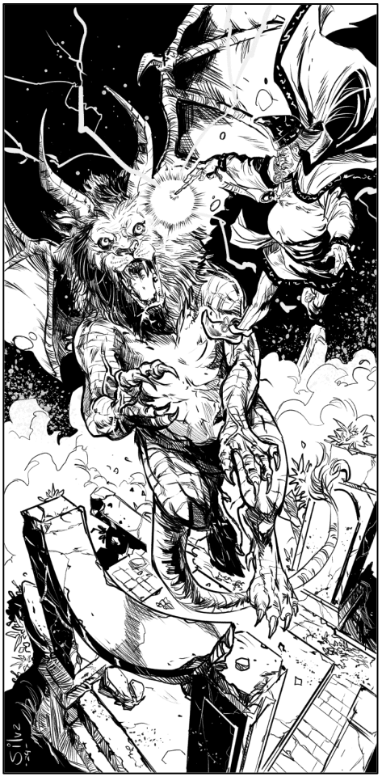

Um leão alado mutado com aspectos reptilianos,
de escamas verde-musgo e uma mordida
venenosa que torna a carne da vítima mais
macia, e sua digestão mais eficiente. Não, não é
uma Mantícora. Essa formidável criatura mede 2,5
metros de altura enquanto apoiada em quatro
patas, mas seu comprimento chega a 7 metros.
Pode alcançar altitudes consideráveis com suas
asas robustas. Apesar de seu aspecto de réptil, o
animal ainda retém sua essência mamífera de
tempos pré-mutação. Normalmente há apenas
um macho por alcateia.

> **IN** +3 **CA** 16 **DV** 6d8 (24)
>
> **AT** #3 Garra x2 (1d6) ou Mordida (1d8)
>
> **BN** +3 **JdP** V11/R11/M12 **VS** Infravisão 60'
>
> **MV** 40' (60' voando) **ML** 9
>
> **TM** Grande **TT** Critério do Mestre **XP** 500

## Habilidades Especiais

**Veneno:** Se uma mordida for bem-sucedida,
enzimas venenosas serão injetadas em sua carne,
demandando uma JdP de Vigor com penalidade
de -3, ou a vítima passará a perder 1 PV por
rodada. Após chegar a ⅓ dos PV máximos, os
músculos começam a perder tensão, de modo
que o corpo mal consegue se sustentar em pé, ou
efetuar movimentos bruscos com os braços. Se a
vítima sobreviver e despertar, ela não regenera
PV, tampouco podendo se locomover sozinha. A
cura não-mágica para tal veneno está no
consumo da flor de urze (presente em A3, ou em
qualquer transição na qual o mestre julgue
apropriado, mediante testes pertinentes).

## Créditos

**Fonte:** O Amuleto na Montanha Mutilada, p. 55
