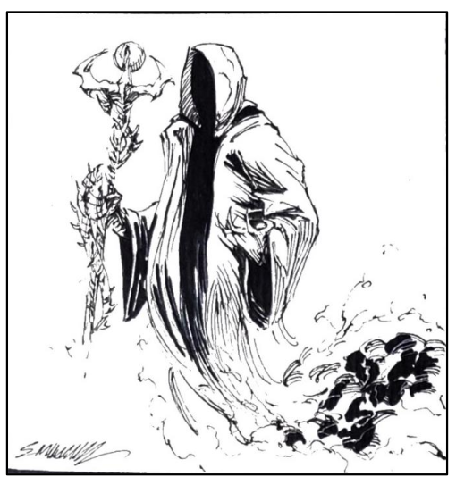

A cópia espectral do Grão-Mestre Thalassar. É
como um vigilante astral, mas com aparência
mais vívida. É possível detectar as feições
escamosas e, ao mesmo tempo, élficas, de seu
poderoso conjurador. Por parecer mais real, anda
como se seus pés fantasmas colidissem com o
chão, mas ainda pode atravessar paredes e voar,
como um Vigilante Astral. Acessa algumas magias
de seu conjurador e possui corpo difuso, mas
atingível por armas mágicas.





## Créditos

**Fonte:** O Amuleto na Montanha Mutilada, p. 56
