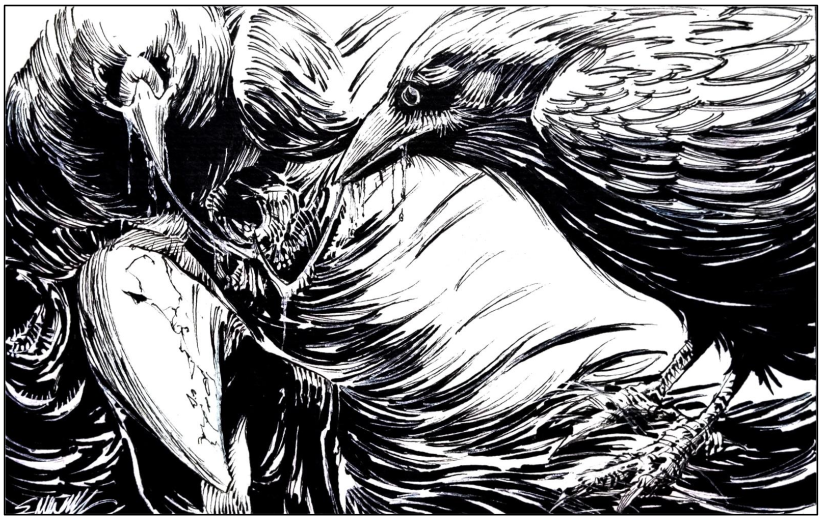

Um corvo de bico afiado e maior do que o
comum. De sua origem, parece que foram
mutados após o consumo de um cadáver durante
o grande fracasso do ritual Tul’sanir, nos primórdios
da instabilidade de mana. Agressivos e sedentos
por sangue, não mais esperam que um animal (ou
humano) vire cadáver para consumi-lo, e já não
morrem com a idade.

Os corvos andam em bandos e memorizam as
faces de suas vítimas. Caso não consigam
consumir seu sangue e precisem bater retirada,
buscarão vingança.





## Créditos

**Fonte:** O Amuleto na Montanha Mutilada, p. 57
