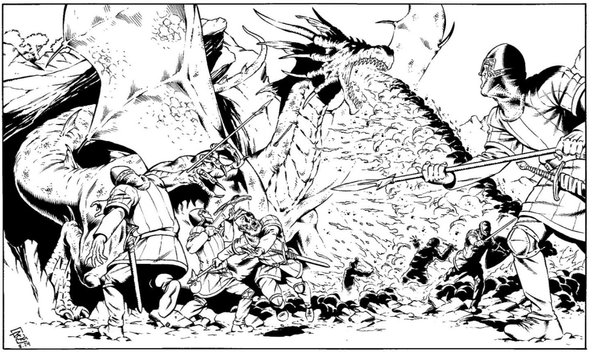

Um lagarto voador colossal de escamas
vermelhas e barriga amarelada. Este não é o
dragão “realista” que vemos por aí, mas o nobre
clássico com quatro patas e duas asas enormes
feito as dos morcegos. Com voracidade
demoníaca e vivência milenar, esta criatura não é
facilmente enganada e caça seus alvos com
paciência e tática. O dragão foi usado de
montaria por Thalassar, mas já não aguarda seu
retorno. Quem conseguir o precioso cajado na
sala do Grão-Mestre, certamente poderá tentar
domesticar esse terrível animal. Mede 15 metros
de comprimento, 3 de largura e 8 de altura.





## Créditos

**Fonte:** O Amuleto na Montanha Mutilada, p. 58
