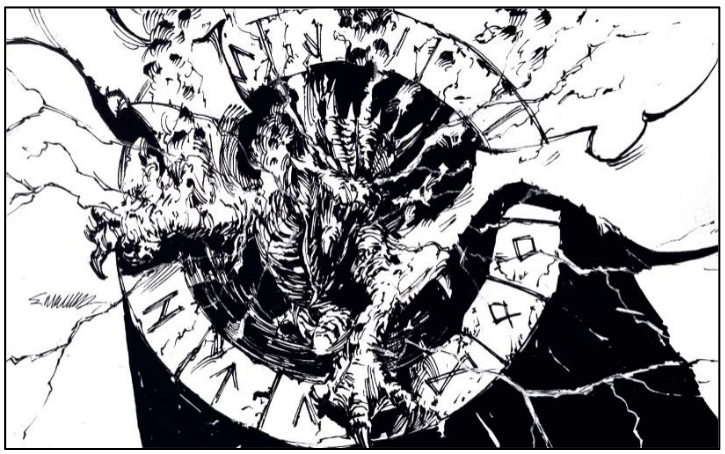

Uma aberração do plano elemental, modelada
conforme os desejos de Thalassar para assumir a
forma de um dragão de poeira e nuvens
carregadas, que podem alterar sua densidade ao
ponto quase sólido. O toque de mestre, no
entanto, foi imbuir este elemental com
relâmpagos potentes, além de intimidantes, que
iluminam os olhos e boca da criatura em intervalos
cintilantes. Este ser também pode mudar de
tamanho como quiser, mas em seu estado
“natural” possui 6 metros de comprimento, 2 de
largura e 2 de altura. Seu lar é o poço monumental
no jardim do Palacete dos Mestres.





## Créditos

**Fonte:** O Amuleto na Montanha Mutilada, p. 59
