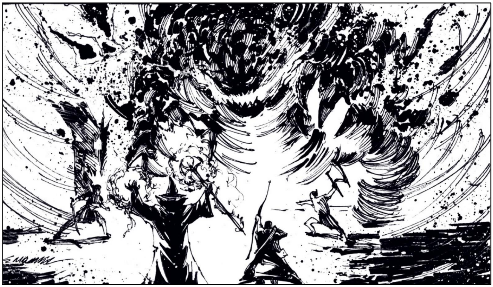

Um dos primeiros elementais a descer ao plano
terrestre, era cultuado por Tul’sanir dos primórdios,
antes do império tomar seu extenso vulto. Até o
momento, protege a honra dos Grão-Mestres
caídos, a despeito de sua corrupção contínua.
Sua morada é uma urna que fica ao centro do
mausoléu dos cinco Grão-Mestres antes de
Thalassar (ver A8-N3). Assume a mesma forma de
um Elemental do Ar, embora mais imponente e
denso, contando com 4 metros de altura e 2 de
largura. Pode se comunicar de modo rudimentar,
apenas na linguagem Tul’sanir.





## Créditos

**Fonte:** O Amuleto na Montanha Mutilada, p. 60
