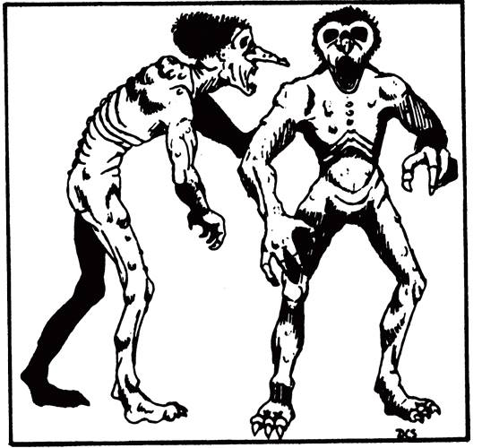

Humanoides inteligentes, perversos, com corpos emagrecidos e pele emborrachada. Consomem a carne de outros humanóides.

> **IN** +0 **CA** 16 **DV** 6d8+5 (30)
>
> **AT** #2 Garras (1d4) ou #1 Mordida (2d6)
>
> **BN** +3 **JdP** V10/R11/M14
>
> **MV** 40' **ML** 9
>
> **TM** Grande **TT** -

## Habilidades Especiais

**Regeneração:** O troll regenerar 1 PV no início de cada um dos seus turnos. Essa regeneração é capaz de regenerar membros amputados.

**Fraqueza:** Recebe o dobro do dano por fogo ou ácido. Dano causado dessas fontes também impede a regeneração do troll.

**Falsa Morte:** Quando é reduzido a 0 PV retornam a vida em 1d6 minutos, a não ser que seus restos sejam destruídos por fogo ou ácido.

