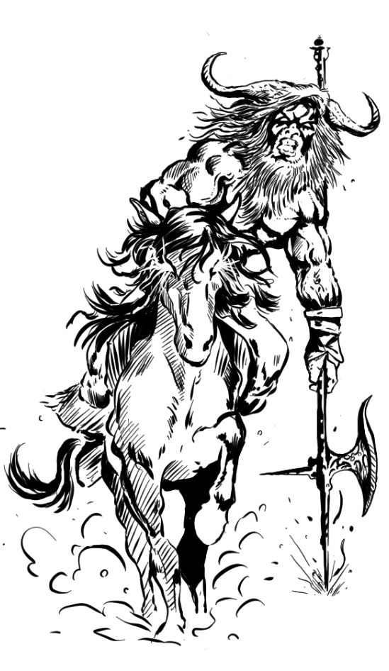

Um estivador incansável, de
terras longínquas, Bóris sabia que
podia fazer mais. Após anos de
trabalhos duros empurrando arados,
resolveu colocar os músculos
para algo mais nobre: a matança.

Sua [**Montaria de Guerra**]() é um animal formidável,
treinado para o combate. Só pode ser montado pelos mais aptos cavaleiros.





## Créditos

**Fonte:** Devorador de Destinos, p. 31
