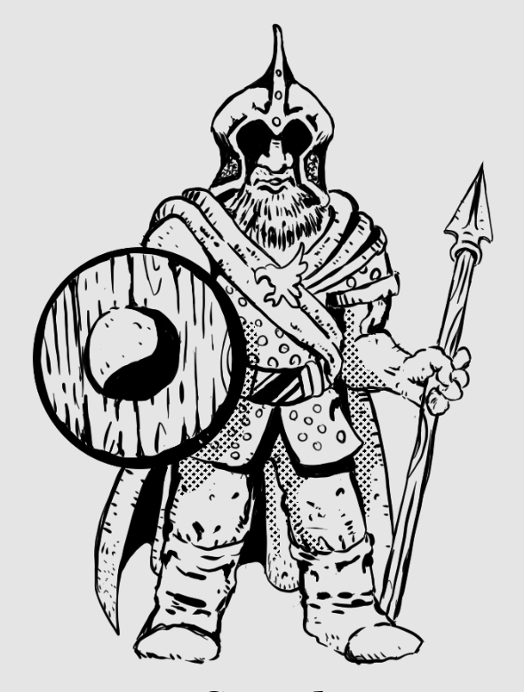

Vestem blusões de malha, equipados
de escudos e elmos cristados. Todos
possuem capas turquesa, presas
por abotoaduras de latão em forma
de águia.





## Créditos

**Fonte:** Devorador de Destinos, p. 29
