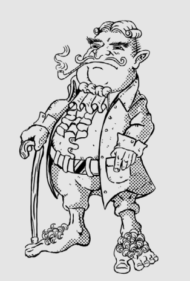

Um pequenino rechonchudo e mais peludo que de costume, com sobrancelhas grossas
e bigodes longos. Veste uma roupa de tecidos finos adamascados e um adereço
peitoral exuberante.





## Créditos

**Fonte:** Devorador de Destinos, p. 30
