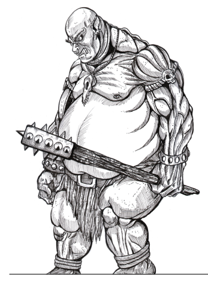

Vestidos com remendos de couro podre, manchados de sangue seco, estes
grandes humanoides sempre acreditam estar de estômago vazio (o que justifica o
fato de que suas bocas estão constantemente lambuzadas com saliva gotejante).





## Créditos

**Fonte:** Devorador de Destinos, p. 30
