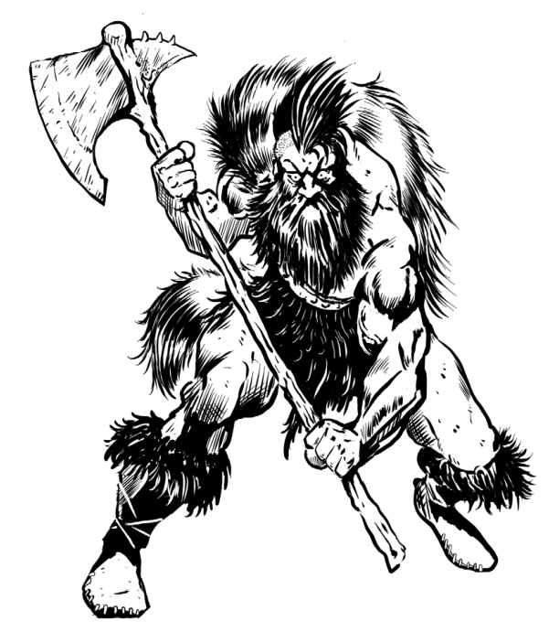

Um vândalo que reuniu as tribos
bárbaras com o terror do aço. Acredita
que a vida sedentária das cidades
e fazendas é para os fracos, e que
estes existem para serem pilhados e
alimentar os fortes. Faz da conquista
seu passatempo, como sugere o
autoproclamado título.





## Créditos

**Fonte:** Devorador de Destinos, p. 30
