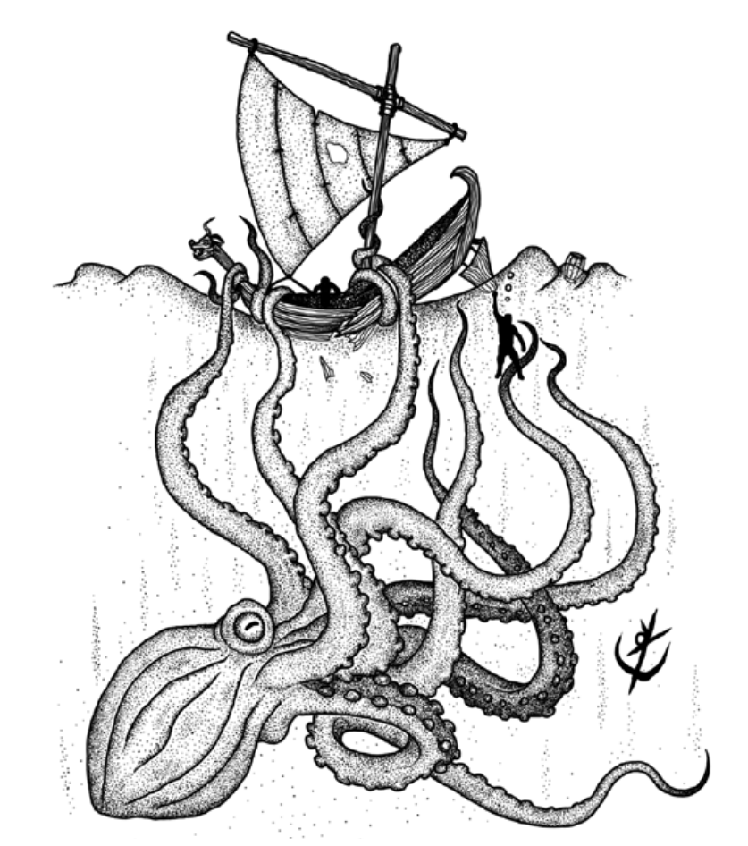

> **IN** +1 **CA** 13 **DV** 3d8+15 (30)
>
> **AT** # Tentáculo (1d6) ou Bico Venenoso (1d4+3)
>
> **BN** +2 **JdP** V11/R12/M15 **VS** Infravisão 60'
>
> **MV** 20' (60' embaixo da água) **ML** 6
>
> **TM** Gigante **TT** - **XP** 75

## Habilidades Especiais

**Cabeçada:** Provoca 2d10 de dano estrutural em embarcações.

## Créditos

**Fonte:** Guia do Aventureiro, p. 119.

Arte por [Yuri Perkowski Domingos](https://www.artstation.com/perkowski) ([@yuri.perkowski](https://www.instagram.com/yuri.perkowski/)).