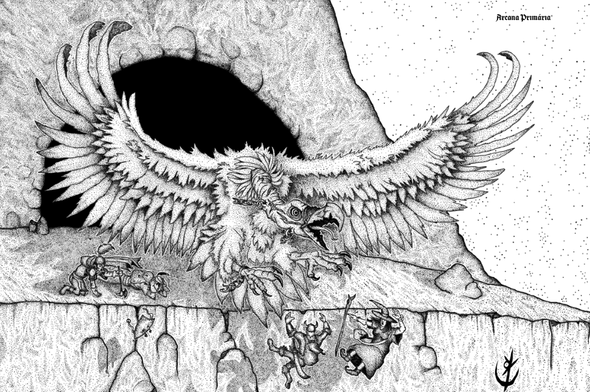

* Ao se sentir ameaçado, Altatla poderá usar sua Ventania
  antes de alçar voo e se reposicionar, evitando assim
  ataques de oportunidade.

* Personagens que busquem saltar nas costas do titâ-
  nico abutre devem ser bem-sucedidos em um teste de
  força ou destreza CD 16. O mestre então pode conceder
  bônus no ataque ou no dano, conforme achar adequado.
  Nesse caso, uma das opções de Altalta é voar e exe-
  cutar giros para derrubar o oponente mediante uma
  jogada de proteção de reflexos

> **IN**  **CA**  **DV** 
>
> **AT** # 
>
> **BN** +3 **JdP**  **VS** Infravisão 60'
>
> **MV** 40' (90' voando) **ML** -
>
> **TM** Gigante [**TT** III]() **XP** 575

## Habilidades Especiais



**Ventania:** Criaturas em até 60’ à frente de Altatla devem ser
bem-sucedidas em uma jogada de proteção de reflexos, ou
receberão 1d4 pontos de dano e serão empurrados 20’ para trás. Se
bem-sucedidas, recebem metade do dano, sem demais efeitos.

**Rasante:** Altatla desce em um rasante, atacando todas as
criaturas em seu caminho. Vítimas devem ser bem-sucedidas
em uma jogada de proteção de reflexos, ou receberão 1d6
pontos de dano, sendo derrubadas. Criaturas bem-sucedidas
não recebem dano e demais efeitos.

## Créditos

**Fonte:** Guia do Aventureiro, p. 129

Arte por [Yuri Perkowski Domingos](https://www.artstation.com/perkowski) ([@yuri.perkowski](https://www.instagram.com/yuri.perkowski/)).
