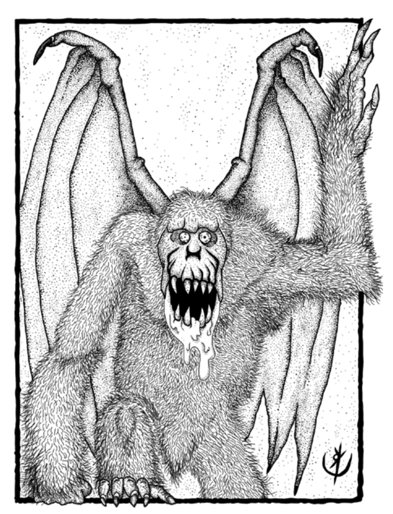

> **IN** +1 **CA** 12 **DV** 2d8 (10)
>
> **AT** #1 Garra (1d4)
>
> **BN** +1 **JdP** V12/R13/M16 **VS** Infravisão 60'
>
> **MV** 30' (60' voando) **ML** 6
>
> **TM** Médio [**TT** II]() **XP** 25

## Habilidades Especiais

**Cuspe Ácido:** Vítimas a até 15’ que falharem em sua jogada
de proteção de vigor recebem 1d6 pontos de dano.
Se bem-sucedidas, recebem apenas metade.

## Créditos

**Fonte:** Guia do Aventureiro, p. 120

Arte por [Yuri Perkowski Domingos](https://www.artstation.com/perkowski) ([@yuri.perkowski](https://www.instagram.com/yuri.perkowski/)).
