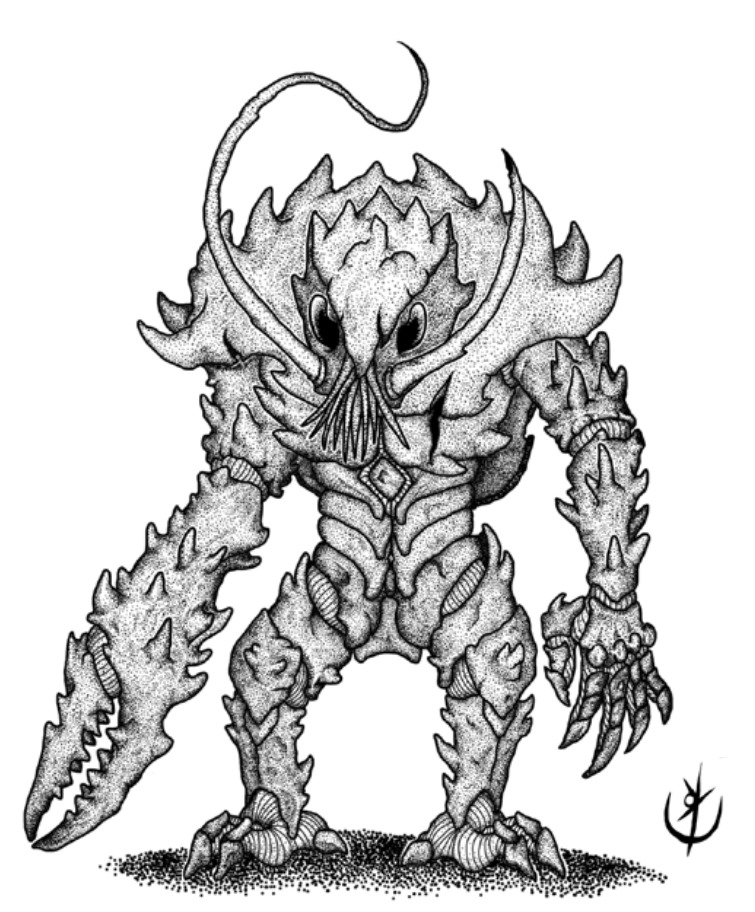

Protegidos por uma espessa carapaça violácea e terríveis
pinças mutantes.

> **IN** +1 **CA** 18 **DV** ed8 (10)
>
> **AT** #1 Pinça (1d6) ou Garra (1d4)
>
> **BN** +1 **JdP** V12/R13/M16 **VS** Infravisão 60'
>
> **MV** 30' **ML** 5
>
> **TM** Médio **TT** [V](link_tabela_tesouro)

## Habilidades Especiais

Prensa: O carapaçoide prensa um braço ou perna da vítima,
paralisando-a e decepando o membro ao fim de 1d4+1 roda-
das. A vítima tem direito a uma jogada de proteção de vigor
por rodada para se desvencilhar. Se o membro for decepado,
a vítima recebe 1d8+3 pontos de dano.

## Créditos

**Fonte:** [Guia do Aventureiro, p. 120](https://www.arcanaprimaria.com/about-3)

Arte por [Yuri Perkowski Domingos](https://www.artstation.com/perkowski) ([@yuri.perkowski](https://www.instagram.com/yuri.perkowski/)).
