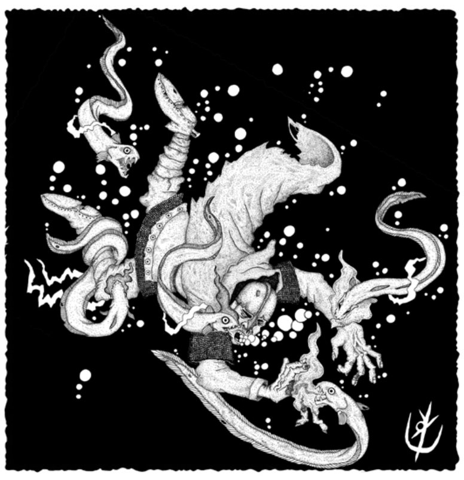

> **IN** +2 **CA** 12 **DV** 2d8 (10)
>
> **AT** #1 Mordida (1d4)
>
> **BN** +1 **JdP** V12/R13/M16 **VS** Infravisão 60'
>
> **MV** 60' **ML** 7
>
> **TM** Médio **TT** - **XP** 25

## Habilidades Especiais

**Descarga Elétrica:** Vítimas em até 10’ do cardume que
falharem em uma jogada de proteção de vigor, recebem
1d4 pontos de dano. Se bem-sucedidas, recebem metade.

## Créditos

**Fonte:** Guia do Aventureiro, p. 121

Arte por [Yuri Perkowski Domingos](https://www.artstation.com/perkowski) ([@yuri.perkowski](https://www.instagram.com/yuri.perkowski/)).
