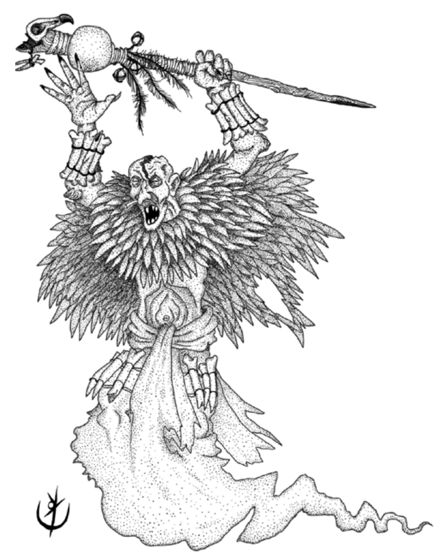

Fantasmas de antigos sacerdotes, adornados por penas
e ossos. Veneradores do grande abutre.

> **IN** +0 **CA** 12 **DV** 1d8+2 (7)
>
> **AT** #1 Cajado de Chocalhos (1d6)
>
> **BN** +1 **JdP** V11/R12/M15 **VS** Infravisão 60' 
>
> **MV** 30' (40' voando) **ML** 5
>
> **TM** Médio **TT** -

## Habilidades Especiais

**Benção de Altatla:** Cura 1d4 PV.

**Resistência:** Ataques físicos provocam metade do dano.

## Créditos

**Fonte:** [Guia do Aventureiro, p. 121](https://www.arcanaprimaria.com/about-3)

Arte por [Yuri Perkowski Domingos](https://www.artstation.com/perkowski) ([@yuri.perkowski](https://www.instagram.com/yuri.perkowski/)).
