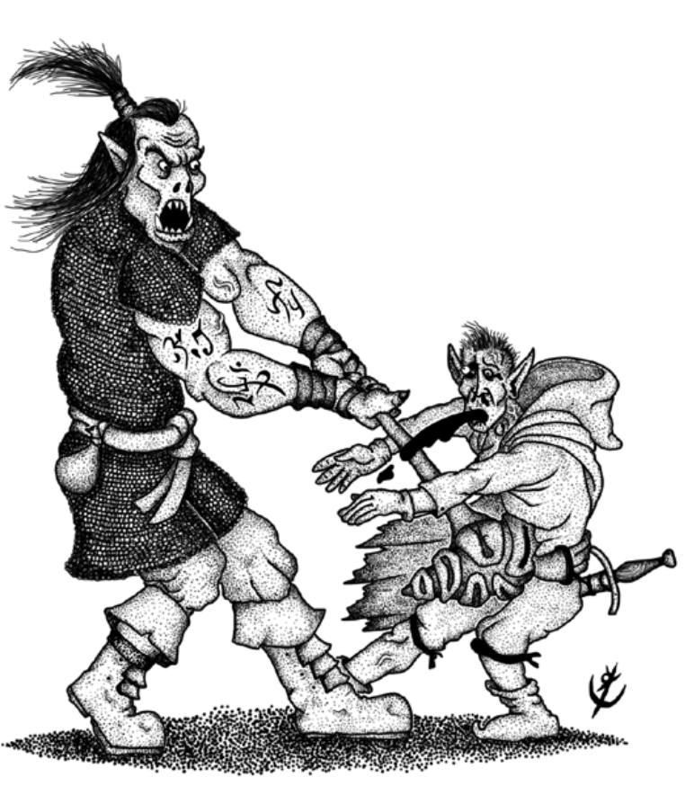

> **IN** +2 **CA** 14 **DV** 3d8 (15)
>
> **AT** #1 Martelo Coralíneo (1d8+1)
>
> **BN** +2 **JdP** V11/R12/M15
>
> **MV** 30' **ML** 6
>
> **TM** Médio **TT** [II](link_tabela_tesouro) **XP** 50

## Habilidades Especiais

**Magias Psiônicas:**

 * 1º Círculo (2x): 
   * Alterar Percepção, 
   * Enfeitiçar Criaturas, 
   * Fogo Epistêmico.
 * 2º Círculo (1x): 
   * Evasão Premeditada,
   * Leveza de Piskor.

## Créditos

**Fonte:** [Guia do Aventureiro, p. 122](https://www.arcanaprimaria.com/about-3)

Arte por [Yuri Perkowski Domingos](https://www.artstation.com/perkowski) ([@yuri.perkowski](https://www.instagram.com/yuri.perkowski/)).
