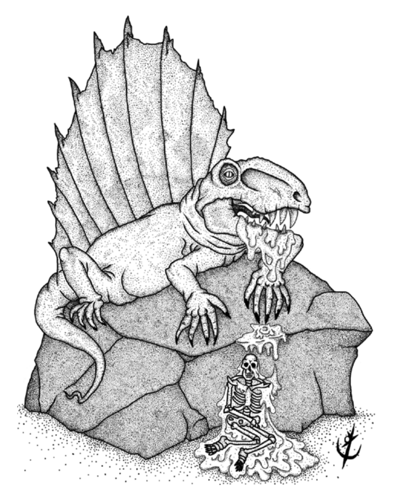

> **IN** +2 **CA** 12 **DV** 2d6 (5)
>
> **AT** #1 Mordida (1d6)
>
> **BN** +1 **JdP** V12/R13/M16
>
> **MV** 30' **ML** 6
>
> **TM** Grande **TT** - **XP** 25

## Habilidades Especiais

**Jato Venenoso:** Uma vítima em até 45’ deve ser bem-sucedida 
em uma jogada de proteção de vigor, ou recebe 1d4
pontos de dano e fica cega até a próxima rodada.

## Créditos

**Fonte:** Guia do Aventureiro, p. 122

Arte por [Yuri Perkowski Domingos](https://www.artstation.com/perkowski) ([@yuri.perkowski](https://www.instagram.com/yuri.perkowski/)).
