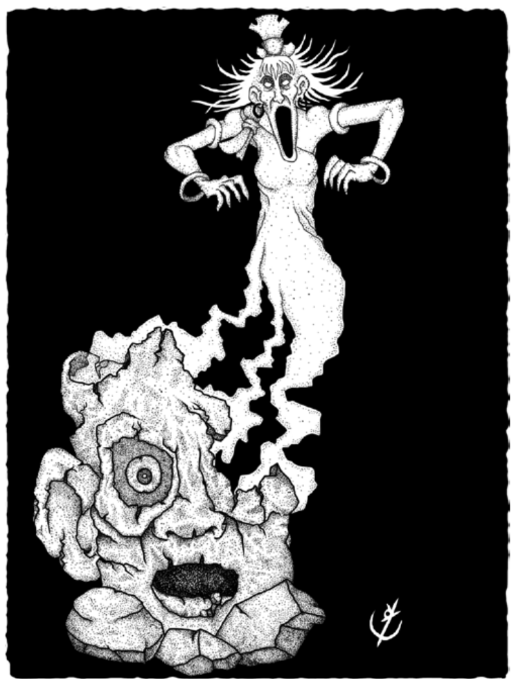

> **IN** +0 **CA** 12 **DV** 1d8 (5)
>
> **AT** #1 Golpe Amaldiçoado (1d4)
>
> **BN** +1 **JdP** V11/R12/M15 **VS** Infravisão 60'
>
> **MV** 30' (40' voando) **ML** 3
>
> **TM** Médio **TT** - **XP** 7

## Habilidades Especiais

**Golpe Amaldiçoado:** Ataque contra CA. Criaturas atingi-
das não podem receber curas até a próxima rodada.

**Resistência:** Ataques físicos provocam metade do dano.

## Créditos

**Fonte:** Guia do Aventureiro, p. 123

Arte por [Yuri Perkowski Domingos](https://www.artstation.com/perkowski) ([@yuri.perkowski](https://www.instagram.com/yuri.perkowski/)).
