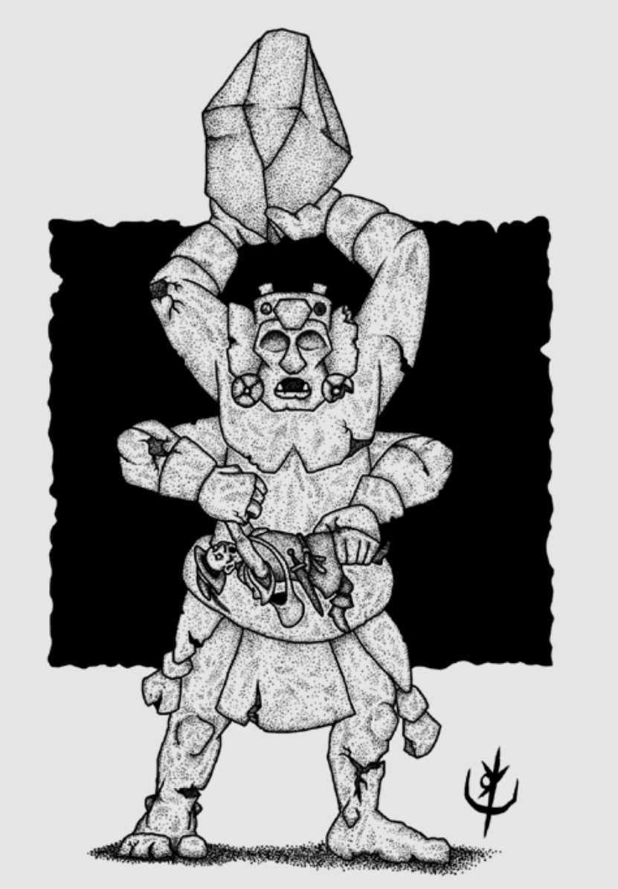

> **IN** +0 **CA** 18 **DV** 4d8+30 (62)
>
> **AT** #2 Punho (2d4)
>
> **BN** +2 **JdP** V11/R12/M15 **VS** Infravisão 60'
>
> **MV** 20' **ML** -
>
> **TM** Gigante **TT** - **XP** 275

## Habilidades Especiais

**Abraço Ancestral:** Criaturas agarradas pela estátua têm
direito a uma jogada de proteção de vigor por rodada,
durante duas rodadas, ao fim das quais terão sua caixa
toráxica esmigalhada e morrerão. Sucesso na jogada de
proteção livra a vítima do abraço.

**Resistência:** Ataques físicos provocam metade do dano.

## Créditos

**Fonte:** Guia do Aventureiro, p. 123

Arte por [Yuri Perkowski Domingos](https://www.artstation.com/perkowski) ([@yuri.perkowski](https://www.instagram.com/yuri.perkowski/)).
