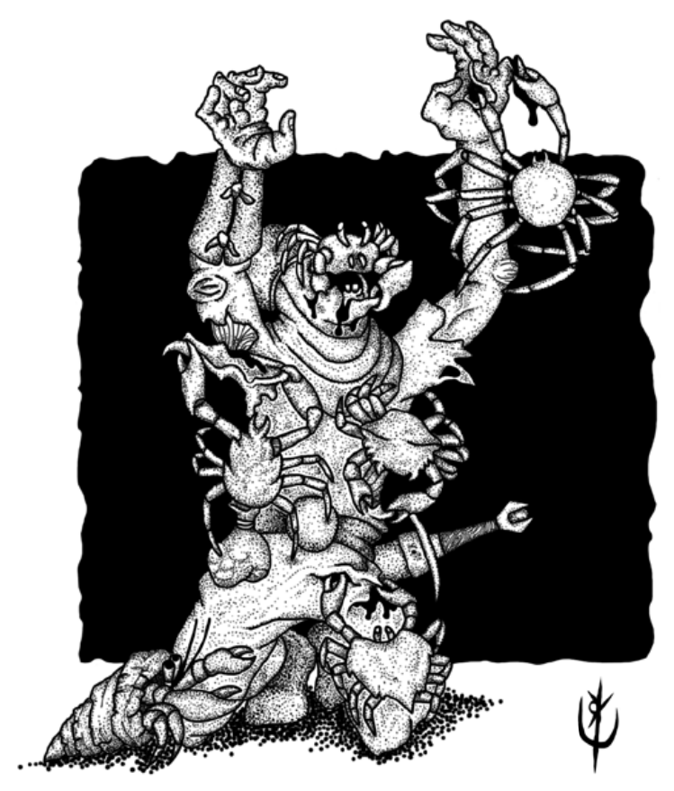

> **IN** +0 **CA** 10 **DV** 1d4 (1)
>
> **AT** #1 Pinçada (1)
>
> **BN** +1 **JdP** V12/R13/M16 **VS** Infravisão 60'
>
> **MV** 30' **ML** -
>
> **TM** Pequeno **TT** - **XP** 5

## Créditos

**Fonte:** [Guia do Aventureiro, p. 124](https://www.arcanaprimaria.com/about-3)

Arte por [Yuri Perkowski Domingos](https://www.artstation.com/perkowski) ([@yuri.perkowski](https://www.instagram.com/yuri.perkowski/)).
