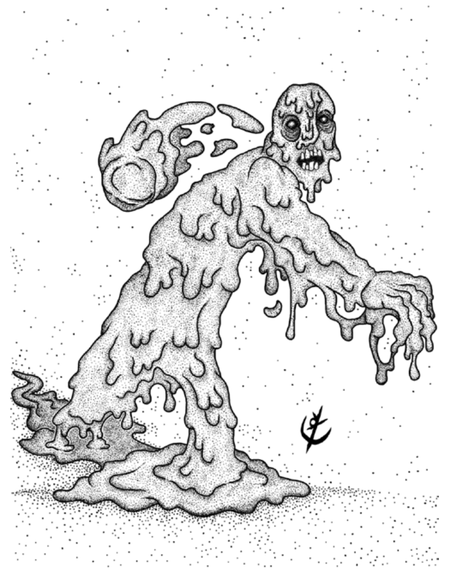

> **IN** +0 **CA** 10 **DV** 1d8 (6)
>
> **AT** #1 Soco (1d4) ou Bolo Lamaçento (1d6)
>
> **BN** +1 **JdP** V12/R13/M16 **VS** Infravisão 60'
>
> **MV** 30' **ML** 7
>
> **TM** Médio [**TT** II]() **XP** 7

## Habilidades Especiais

**Resistência:** Ataques físicos provocam metade do dano.

**Bolo Lamacento:** A criatura remove parte de sua carne
para fazer um ataque contra CA com 60' de alcance.

## Créditos

**Fonte:** Guia do Aventureiro, p. 124

Arte por [Yuri Perkowski Domingos](https://www.artstation.com/perkowski) ([@yuri.perkowski](https://www.instagram.com/yuri.perkowski/)).
