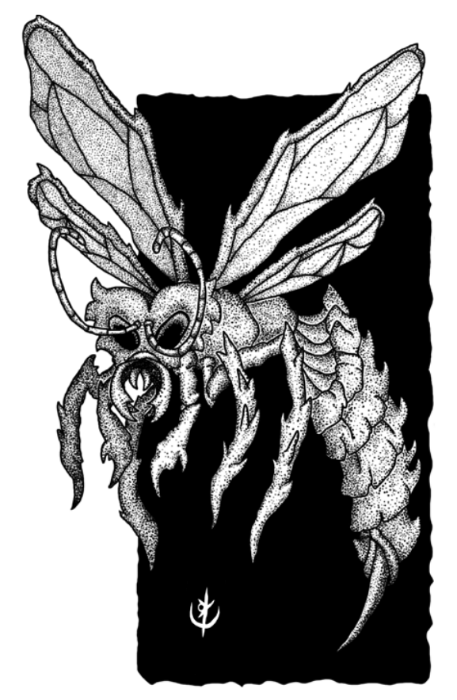

> **IN** +0 **CA** 11 **DV** 1d4 (2)
>
> **AT** #1 Ferroada (1d4)
>
> **BN** +1 **JdP** V12/R13/M16
>
> **MV** 20' (40' voando) **ML** 3
>
> **TM** Pequeno **TT** - **XP** 6

## Habilidades Especiais

**Ferroada:** Criaturas acertadas, após 1 hora, desenvolvem
erupções na pele e alucinam. Curas simples não surtem
efeito, apenas procedimentos ou magias que removam
venenos. Ao final de 6 horas, perdem 1 ponto permanente
de Sabedoria. O efeito não é cumulativo.

## Créditos

**Fonte:** Guia do Aventureiro, p. 125

Arte por [Yuri Perkowski Domingos](https://www.artstation.com/perkowski) ([@yuri.perkowski](https://www.instagram.com/yuri.perkowski/)).
