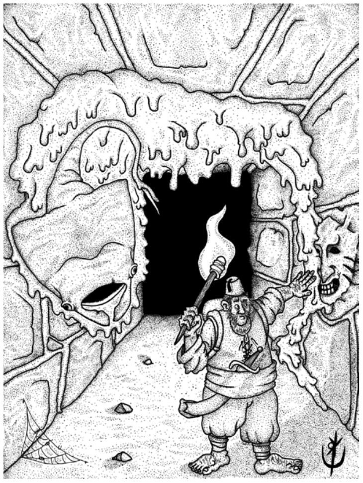

> **IN** +1 **CA** 14 **DV** 3d8 (10)
>
> **AT** #1 Ferrão (1d8) ou Mordida (1d6)
>
> **BN** +2 **JdP** V11/R12/M15 **VS** Infravisão 60'
>
> **MV** 40' **ML** 6
>
> **TM** Médio **TT** - **XP** 65

## Habilidades Especiais

**Pseudópode:** O Naklix pode se fixar em vítimas médias ou
pequenas. A vítima deve ser bem-sucedida em uma jogada
de proteção de reflexos, ou ficará paralisada sob o corpo
gelatinoso da criatura, vulnerável à sua terrível ferroada.
Qualquer acerto ao Naklix cessa o efeito.

**Ferrão:** Vítimas que falharem em uma jogada de proteção
de vigor recebem 1d8 pontos de dano, além de começar a
expelir uma secreção viscosa pelos poros que lhe confere
uma penalidade de -2 em jogadas de proteção de reflexos
por 1d4 horas. Sucesso no teste significa metade do dano,
sem demais efeitos.

## Créditos

**Fonte:** Guia do Aventureiro, p. 125

Arte por [Yuri Perkowski Domingos](https://www.artstation.com/perkowski) ([@yuri.perkowski](https://www.instagram.com/yuri.perkowski/)).
