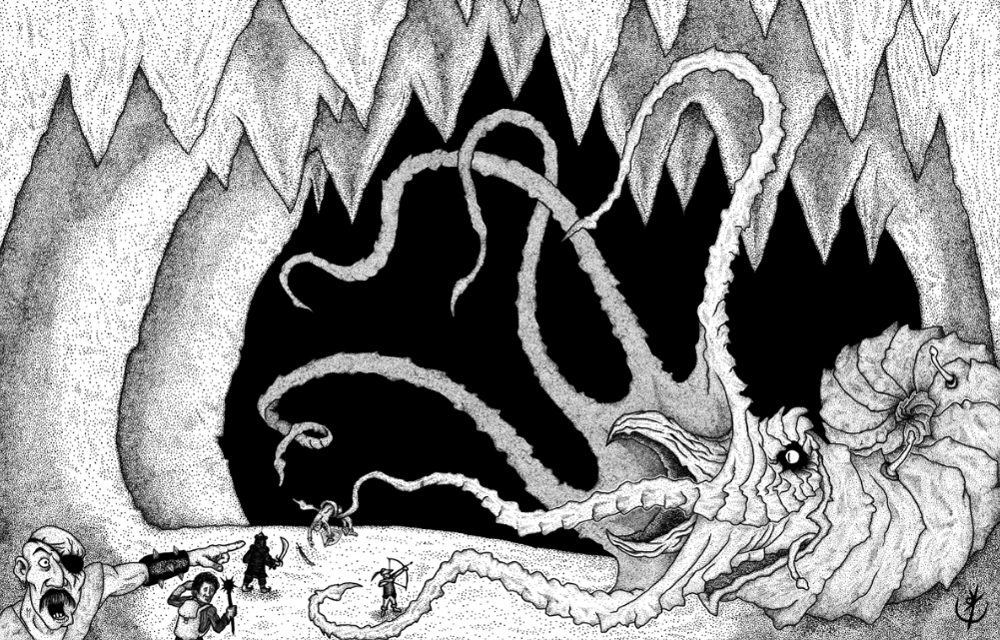

## Nautchlizxor (1ª fase)

 * O casco de Nauthlizxor é impenetrável. Só é possível causar danos nas suas antenas ou
   acessando a sua face.

 * Ao chegar à 50 PV, ou quando tiver 4 antenas derrotadas, Nauthlizxor se retrai 45' para
   sua carapaça (2ª fase).

> **IN** +0 **CA** 16 **DV** 6d8+100 (130)
>
> **AT** #4 Raio de Antena (1d4+1) ou Tentáculo Facial (1d6)
>
> **BN** +3 **JdP** V10/R15/M13 **VS** Infravisão 60'
>
> **MV** 20' (40' nadando) **ML** -
>
> **TM** Titânico **TT** - **XP** 1850

### Habilidades Especiais

**Jato de Tinta:** Solta um jato de tinta negra que empurra e
derruba qualquer um à sua frente até uma distância de 40’,
mediante jogada de proteção de reflexos. Essa habilidade é
uma ação reativa.

**Tentáculos:** Ataques com tentáculos só alcançam alvos sobre
sua carapaça se os mesmos estiverem a até 20’ de distância
de sua face. Contra criaturas que estejam à frente de sua face,
no chão, os tentáculos têm alcance de 45’.

**Antenas:** Possuem CA 13 e 10 PV. Alvejam alvos com um raio
azulado mediante ataque contra CA. O raio possui alcance de
60’ e provoca 1d4+1 pontos de dano. Danos nas antenas não
são abatidos de Nautchlizxor diretamente, mas, para cada
antena derrotada, Nautchlizxor perde 20 PV.

**Desestabilizar Plataforma:** Nautchlizxor pode desestabilizar 
telecineticamente o elevador que desce em seu salão.
Criaturas que estejam acima da plataforma devem ser bem-sucedidas 
em uma jogada de proteção de reflexos, ou serão
projetadas 30’ em direção ao casco de Nautchlizxor.

**Magias**:

As magias podem ser lanças a partir das antenas.

 * 1º Círculo (4x): Adagas do Desespero / Enfeitiçar Criaturas / Telepatia Menor
 * 2º Círculo (2x): Leveza de Piskor / Percepção Extra-Sensorial / Infligir Dor
 * 3º Círculo (2x): Estrangular

## Nautchlizxor (2ª fase)

 * Nessa fase, Nautchlizxor se retrai 45’ para o
   interior de sua carapaça. Adentrar a carapaça é como entrar em uma caverna.
   Ao fundo, a face da criatura é visível.

 * Nautchlizxor evoca 3 [lacaios-caranguejo]() a cada 3
   rodadas do lado de fora da carapaça.

 * A cada 5 minutos que os aventureiros não atacarem
   Nautchlizxor neste estado, ele recupera 2d10+20 PV.
   Se ele se recuperar totalmente, retorna-se à 1ª fase.

> **IN** +0 **CA** 16 **DV** 50 PV
>
> **AT** #2 Tentáculo Facial (1d6)
>
> **BN** +3 **JdP** V10/R15/M13 **VS** Infravisão 60'
>
> **MV** 20' (40' nadando) **ML** -
>
> **TM** Titânico [**TT** IV]() **XP** -

### Habilidades Especiais

**Jato de Tinta:** Solta um jato de tinta negra que empurra e
derruba qualquer um à sua frente até uma distância de 40’,
mediante jogada de proteção de reflexos. Essa habilidade é
uma ação reativa.

**Tentáculos:** Ataques com tentáculos só alcançam alvos sobre
sua carapaça se os mesmos estiverem a até 20’ de distância
de sua face. Contra criaturas que estejam à frente de sua face,
no chão, os tentáculos têm alcance de 45’.

**Magias**:

As magias podem ser lanças a partir das antenas.

* 1º Círculo (4x): Adagas do Desespero / Enfeitiçar Criaturas / Telepatia Menor
* 2º Círculo (2x): Leveza de Piskor / Percepção Extra-Sensorial / Infligir Dor
* 3º Círculo (2x): Estrangular

## Créditos

**Fonte:** Guia do Aventureiro, p. 130

Arte por [Yuri Perkowski Domingos](https://www.artstation.com/perkowski) ([@yuri.perkowski](https://www.instagram.com/yuri.perkowski/)).
