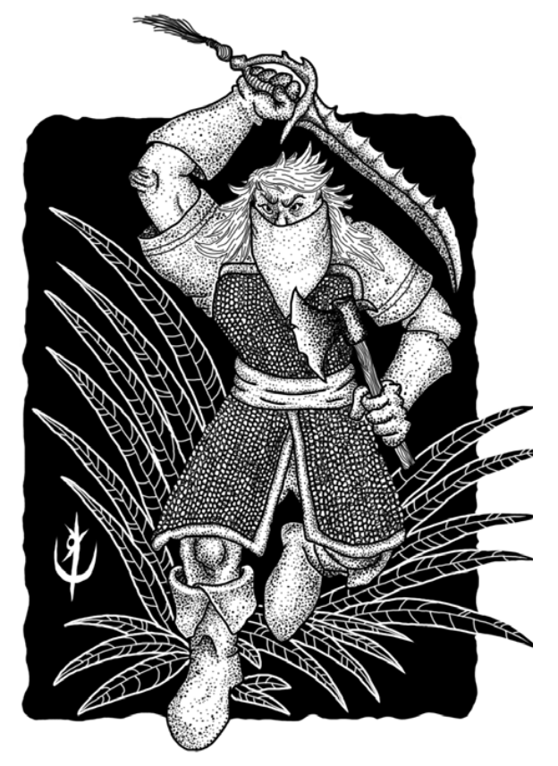

> **IN** +3 **CA** 12 **DV** 1d8 (4)
>
> **AT** #1 Faca (1d4) ou Arco Curto (1d6)
>
> **BN** +1 **JdP** V12/R13/M16
>
> **MV** 40' **ML** 8
>
> **TM** Médio [**TT** II]() **XP** 6

## Habilidades Especiais

**Debilitar:** Disparo com penalidade de -2 que reduz o 
movimento da criatura pela metade, por 1d4 rodadas. O dano
é aplicado normalmente.

## Créditos

**Fonte:** Guia do Aventureiro, p. 125

Arte por [Yuri Perkowski Domingos](https://www.artstation.com/perkowski) ([@yuri.perkowski](https://www.instagram.com/yuri.perkowski/)).
