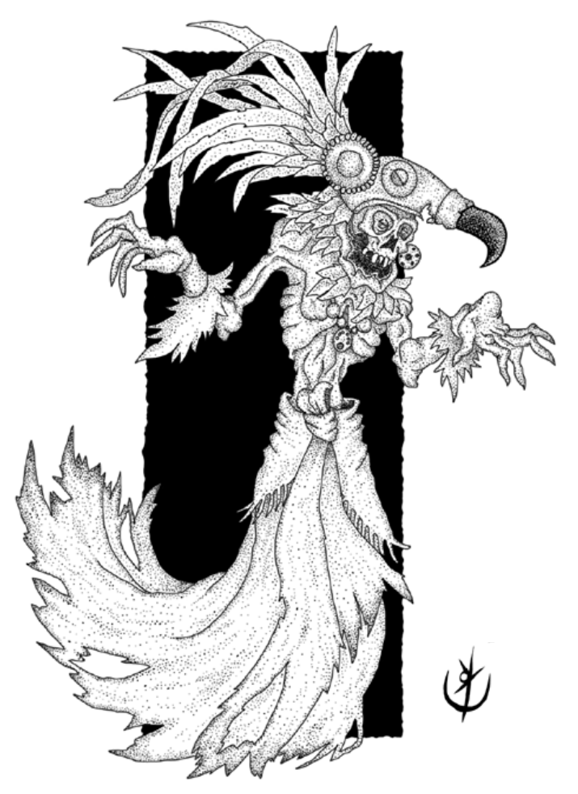

> **IN** +0 **CA** 12 **DV** 2d8+6 (18)
>
> **AT** #1 Cetro Espectral (1d6+1)
>
> **BN** +1 **JdP** V12/R14/M13 **VS** Infravisão 60'
>
> **MV** 30' (40' voando) **ML** -
>
> **TM** - **TT** - **XP** 45

## Habilidades Especiais

*Renascer:* Se mais de um inimigo estiver adjacente à Cozca,
ela se desintegra em uma onda que provoca 1d4+1 pontos de
dano a todos que estiverem adjacentes a ela e falharem em
uma jogada de proteção contra magia. Cozca imediatamente
ressurge, ao lado do membro do grupo com menos PV.

*Resistência:* Ataques físicos provocam metade do dano.

## Créditos

**Fonte:** Guia do Aventureiro, p. 127

Arte por [Yuri Perkowski Domingos](https://www.artstation.com/perkowski) ([@yuri.perkowski](https://www.instagram.com/yuri.perkowski/)).
