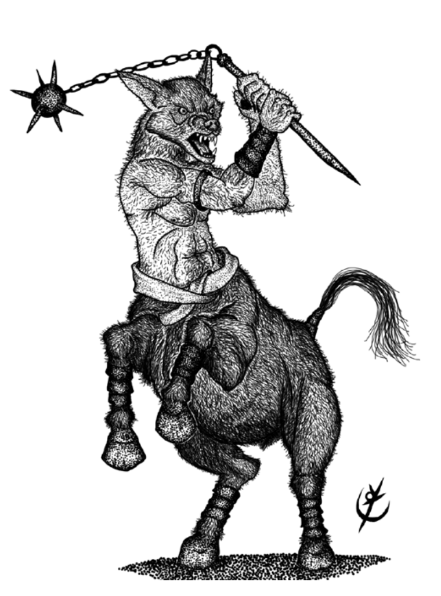

> **IN** +1 **CA** 12 **DV** 2d8 (9)
>
> **AT** #1 Mangual de Cavalaria (1d4+1) ou Coice (1d8)
>
> **BN** +1 **JdP** V12/R13/M16
>
> **MV** 40' **ML** 6
>
> **TM** Médio [**TT** II]() **XP** 30

## Habilidades Especiais

**Investida:** Provoca o dobro de dano, se o Tsakáli correr por
15’ e atacar.

**Abrir Caminho:** Ataque contra CA em leque que acerta até
3 criaturas adjacentes, causa 2 pontos de dano e as empurra
5’ para trás.

## Créditos

**Fonte:** Guia do Aventureiro, p. 127

Arte por [Yuri Perkowski Domingos](https://www.artstation.com/perkowski) ([@yuri.perkowski](https://www.instagram.com/yuri.perkowski/)).
