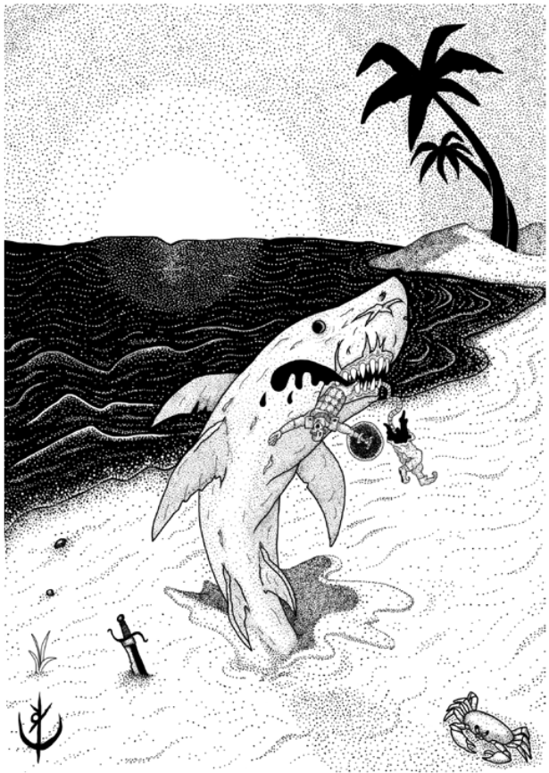

> **IN** +2 **CA** 12 **DV** 1d8 (5)
>
> **AT** #1 Mordida (1d6)
>
> **BN** +1 **JdP** V11/R12/M15
>
> **MV** 30' (60' embaixo da areia) **ML** 7
>
> **TM** Grande **TT** - **XP** 6

## Habilidades Especiais

Dilacerar: Ao efetuar acerto crítico, a vítima deve ser 
bem-sucedida em uma jogada de proteção de vigor, ou terá um
membro de seu corpo decepado (escolha do mestre).

## Créditos

**Fonte:** Guia do Aventureiro, p. 128

Arte por [Yuri Perkowski Domingos](https://www.artstation.com/perkowski) ([@yuri.perkowski](https://www.instagram.com/yuri.perkowski/)).
