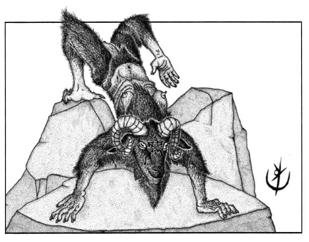

> **IN** +1 **CA** 12 **DV** 1d8 (5)
>
> **AT** #1 Cabeçada (1d4+1)
>
> **BN** +1 **JdP** V12/R13/M16 **VS** Infravisão 60'
>
> **MV** 45' **ML** 7
>
> **TM** Médio **TT** - **XP** 6

## Habilidades Especiais

**Alpinismo Profano:** Escalam superfícies íngremes na mesma
velocidade de seu movimento.

## Créditos

**Fonte:** Guia do Aventureiro, p. 128

Arte por [Yuri Perkowski Domingos](https://www.artstation.com/perkowski) ([@yuri.perkowski](https://www.instagram.com/yuri.perkowski/)).
